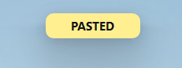
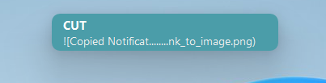
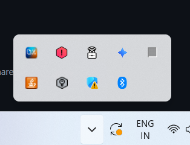
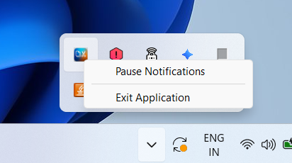

# Windows Clipboard Notifier

A sleek, lightweight C++ utility designed to bring modern visual feedback to Windows whenever you Copy, Cut, or Paste. 

When you trigger a clipboard action, a beautiful, non-intrusive floating notification pops up at the top of your screen displaying the action and a snippet of the text you interacted with.

## 📸 Screenshots

>
> *(Example: Image of the "COPIED" notification)*  
> 
> 
> *(Example: Image of the "PASTED" notification)*  
> 

> *(Example: Image of the "CUT" notification)*  
> 

## ✨ Features

- **Modern UI Styling**: Fully utilizes Windows Desktop Window Manager (DWM) composition for flawless anti-aliased rounded corners and native drop shadows.
- **Smart Adaptive Layout**: The popup gracefully shrinks down to a small, pill-shaped indicator if there is no text in the clipboard, and cleanly expands to reveal your text contents!
- **Dynamic Color Accents**: 
  - **Copy**: Light Green indicator
  - **Cut**: Deep Green indicator
  - **Paste**: Soft Yellow indicator
- **Spam Protection**: Integrated key debouncing ensures that mashing the keys or holding them down heavily won't cause the visuals to spam or flicker.
- **System Tray Integration**: Quietly runs in the background. Right-click the taskbar tray icon to instantly Pause or Resume notifications, or cleanly exit the application.
- **Zero-Friction Hotkey Quit**: Press `Ctrl + Shift + Q` completely globally to safely terminate the application from anywhere.
- **Ultra Lightweight**: Built purely on the Win32 API natively with almost zero CPU or RAM overhead.

## 🚀 Getting Started

### Prerequisites
- Windows 10 / 11
- A C++ Compiler (e.g., MSVC via Visual Studio or VSCode build tasks)

### Installation
1. Clone this repository to your local machine.
2. Place an icon file named exactly `icon.ico` in the same directory as the source code (this acts as your taskbar icon).
3. Compile `main.cpp`. *(The code relies on standard Windows libraries like `user32.lib` and `dwmapi.lib` which are automatically linked via pragmas).*

### Running Automatically at Startup
If you want this utility to run permanently in the background every time you turn on your laptop:
1. Compile the code to generate the `.exe` file.
2. Right-click the `.exe` file -> **Create Shortcut**.
3. Press `Windows Key + R`, type exactly `shell:startup`, and hit Enter.
4. Drag and drop your new Shortcut into the startup folder that opens.

### How to Exit the App
Because the app runs invisibly in the background, there are two quick ways to close it:
1. **System Tray:** Notice the custom icon in your bottom-right taskbar (next to Wi-Fi/Audio). Right-click it and click **Exit Application**.
2. **Global Hotkey:** Press `Ctrl + Shift + Q` anywhere on your computer to instantly shut it down!

> *(Example: Image to exit app 1)*  
> 

> *(Example: Image to exit app 2)*  
> 

## 🛠️ Built With
- Pure Win32 System API 
- C++

## 📝 License
This project is completely open-source. Feel free to use, modify, and improve it!
